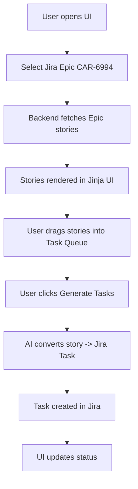

# 📄 AI PROMPT & UI AUTOMATION SPEC
## Project: Jira Task Automation from Epic Stories

---

## Prompt ID
JIRA_TASK_GENERATION_V1

## Owner
Platform / Automation Team

## Status
PRODUCTION APPROVED

---

## 1. PURPOSE

This document defines the **AI prompt contract** and the **end-to-end UI + backend automation** for converting **stories fetched from a Jira Epic** into **Jira Tasks** using:

- Django 5.2.10
- Python 3.12
- Jinja templates
- ChatGPT API
- Jira REST API v3

This system is designed for **engineering managers and delivery teams** to bulk-convert stories into actionable Jira tasks using a **drag-and-drop UI**.

---

## 2. HIGH-LEVEL WORKFLOW



---

## 3. AI ROLE DEFINITION (SYSTEM PROMPT)

> You are a senior Jira delivery manager with strong engineering expertise.
> You generate concise, implementation-ready Jira Tasks.
>
> You return ONLY valid JSON.
> You do NOT explain your reasoning.
> You do NOT include markdown, comments, or prose.


---

## 4. AI INPUT CONTRACT

### Input Variable
`story_text: string`

### Source
- Jira Epic child issue description
- Jira Story summary + description combined

### Example Input

```text
Story:
User should see a clear error message when login fails.
Failures should be logged for debugging.
```

---

## 5. AI OUTPUT CONTRACT (STRICT)

### JSON Schema (Exact)

```json
{
  "summary": "string",
  "description": "string",
  "acceptance_criteria": ["string"]
}
```

### Rules
> [!IMPORTANT]
> Output MUST be valid JSON
>
> No markdown
>
> No extra keys
>
> No explanations

## 6. FIELD GUIDELINES
### summary
- Short, action-oriented
- Jira-friendly
- ≤ 120 characters
- No story IDs (added by backend)

### description
- Clear problem statement
- What + why
- No over-engineering

### acceptance_criteria
- Testable
- Atomic
- Verifiable
- One condition per item

## 7. PROMPT TEMPLATE (USED IN CODE)
```text
Convert the following story into a Jira Task.

Rules:
- Return ONLY valid JSON
- No markdown, no explanations
- Keys must be exactly:
  summary
  description
  acceptance_criteria

Story:
{{STORY_TEXT}}
```

## 8. DJANGO UI ARCHITECTURE (JINJA)
### URLS
- `/jira/epics/`                → Epic selection page
- `/jira/epic/<key>/stories/`  → Drag & drop UI
- `/jira/generate-tasks/`      → POST (automation)

## 9. JINJA UI SPEC (DRAG & DROP)
### UI LAYOUT
```text
+----------------------+----------------------+
| Epic Stories         | Task Queue           |
| (Fetched from Jira)  | (Drag here)          |
|                      |                      |
| [ Story A ]          | [ Story C ]          |
| [ Story B ]          | [ Story D ]          |
|                      |                      |
+----------------------+----------------------+

[ Generate Jira Tasks ]
```

### JINJA TEMPLATE: templates/jira/epic_stories.html
```html
<div class="container">
  <div class="column" id="stories">
    
      <div class="card" draggable="true" data-id="{{ story.key }}">
        {{ story.summary }}
      </div>
    
  </div>

  <div class="column" id="queue"></div>
</div>

<button id="generate">Generate Jira Tasks</button>

<!-- Drag & Drop (Vanilla JS) -->
<script>
let dragged;

document.addEventListener("dragstart", e => {
  dragged = e.target;
});

document.getElementById("queue").addEventListener("dragover", e => {
  e.preventDefault();
});

document.getElementById("queue").addEventListener("drop", e => {
  e.preventDefault();
  e.target.appendChild(dragged);
});
</script>
```

## 10. GENERATE BUTTON → BACKEND FLOW
### JS (POST Selected Stories)
```javascript
document.getElementById("generate").onclick = () => {
  const ids = [...document.querySelectorAll("#queue .card")]
    .map(el => el.dataset.id);

  fetch("/jira/generate-tasks/", {
    method: "POST",
    headers: { "Content-Type": "application/json" },
    body: JSON.stringify({ story_keys: ids })
  });
};
```

## 11. BACKEND RESPONSIBILITIES
### Backend MUST:
- Fetch epic stories via Jira API
- Deduplicate existing tasks
- Call AI with strict prompt
- Validate AI JSON
- Create Jira Task under Epic
- Update UI status

### Backend MUST NOT:
- Trust AI blindly
- Create partial tasks
- Ignore schema violations

## 12. JIRA AUTOMATION RULES
| Condition | Action |
| :--- | :--- |
| Task exists | Skip |
| AI JSON invalid | Fail |
| Jira API error | Retry |
| Partial success | Log + continue |

## 13. ERROR HANDLING CONTRACT
- AI failure → status = FAILED
- Jira failure → retry (max 3)
- UI shows:
  - CREATED
  - SKIPPED
  - FAILED

## 14. VERSIONING & CHANGE CONTROL
Prompt changes require:
- Version bump
- Code review
- Regression validation

Example:
- `JIRA_TASK_GENERATION_V1`
- `JIRA_TASK_GENERATION_V2`

## 15. WHY THIS DESIGN (ENGINEERING RATIONALE)
✔ Prompt treated as API contract
✔ UI decoupled from AI
✔ Drag-and-drop improves delivery workflow
✔ Deterministic automation
✔ Safe for bulk operations
✔ Reviewable by senior engineers

## 16. FINAL NOTE
This document is a production artifact, not documentation fluff.

Changes require:
- Engineering review
- QA validation
- Jira sandbox test

END OF DOCUMENT
